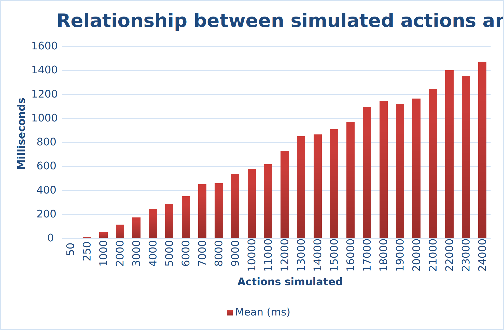
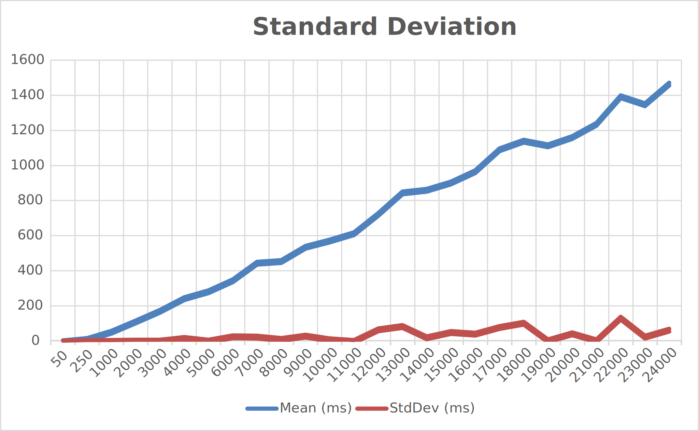

# Simulator Automatic Warehouse


[](https://codecov.io/gh/AndreVale69/simulator-automatic-warehouse)

Go to the complete documentation: [Simulator Automatic Warehouse doc][21].

## Table of Contents

- [Description](#description)
  - [What is an Automatic Warehouse?](#what-is-an-automatic-warehouse)
  - [How it was born](#how-it-was-born)
- [How to Install and Run the Project](#how-to-install-and-run-the-project)
  - [Python Installation](#python-installation)
  - [Basic Example](#basic-example)
  - [Docker](#docker)
- [Benchmarks](#benchmarks)

------------------------------------------------------------------------------------------------------------------------

## Description

The Simulator Automatic Warehouse is a Python library that provides two main functions:
a [digital twin][5] of an automatic warehouse and a simulator of an automatic warehouse.

### What is an Automatic Warehouse?

An Automatic Warehouse, or rather an Automatic Vertical Storage System, 
is a storage system designed to simplify the storage of materials. 
It is generally used in industrial environments and is designed according to the _goods-to-man_ principle: 
the products are brought directly to the picking area (called bay).

### How it was born

This repository was created in 2022 for a bachelor thesis project at the University of Verona, Italy 
(Università di Verona). 
After the creator graduated, he continued to improve the project in order to publish it.

The inspiration came from the [Vertimag][1] by [Ferretto][2], an Italian company based in Vicenza.
The logic of the digitalized warehouse is therefore the same as that of the real Vertimag.

The digitisation of the warehouse was made possible thanks to the [ICE Laboratory][3] of Verona, 
as part of a thesis project at the University of Verona. 
In addition, [Sebastiano Gaiardelli][6] (mainly) and [Marco Panato][7] 
helped the creator at the beginning of the project.

------------------------------------------------------------------------------------------------------------------------

## How to Install and Run the Project

### Dependencies

| Dependency       | Version      |
|------------------|--------------|
| [pandas][8]      | [2.2.3][9]   |
| [simpy][10]      | [4.1.1][11]  |
| [PyYAML][12]     | [6.0.2][13]  |
| [jsonschema][14] | [4.23.0][15] |

### Python Installation

The Simulator Automatic Warehouse requires `Python >= 3.9`.
Python 3.8 is no longer supported, as Python will end support on 2024-10.

It's possible to install the package using [pip][4]:

```bash
pip install simulator-automatic-warehouse
```

Otherwise, you can clone the whole project and install the requirements:

```bash
git clone https://github.com/AndreVale69/simulator-automatic-warehouse
pip install -r requirements.txt
```

### Basic Example

The following code generate a warehouse, create a simulation environment and run a simulation.

```python
from automatic_warehouse.warehouse import Warehouse
from automatic_warehouse.simulation.simulation_type.warehouse_simulation import WarehouseSimulation

# generate a Warehouse
warehouse = Warehouse()

# generate a simulation environment
simulation = WarehouseSimulation(warehouse)

# run the simulation
simulation.run_simulation()

# print the results
print(simulation.get_store_history_dataframe())
```

Note: if a configuration is not specified as an environment variable or is not updated at runtime, 
the [default configuration][16] is used.

### Docker

Everything is easier with Docker.
In the GitHub project, there are a [docker folder][17] and use docker compose to build:

```bash
cd docker
docker compose up alpine-simulator_automatic_warehouse
```

The available docker images are:

- `alpine-simulator_automatic_warehouse`
- `debian-simulator_automatic_warehouse`

To change or add some environment variables, edit [docker-compose.yaml][18].

------------------------------------------------------------------------------------------------------------------------

## Benchmarks

Here are some benchmarks run with a private Python library and the following computer specifications:
 - Intel i7-8750H 
 - SDRAM DDR4-2666 16GB
 - MZ-76Q2T0 860 QVO SSD 2TB 2.5"
 - SSD NVMe M.2 128 GB
 - NVIDIA GeForce GTX 1050

| Actions   | Time to process  | Real-time simulation |
|-----------|------------------|----------------------|
| 10'000    | 570 milliseconds | 1d. 2h. 48m.         |
| 63'000    | 3,5 seconds      | 1 week               |
| 267'900   | 15,3 seconds     | 1 month              |
| 3'250'120 | 3,1 minutes      | 1 year               |

Use the following links if the images are not displayed:
- [Relationship between simulated actions and mean][19]
- [Standard Deviation][20]






[1]: https://www.ferretto.com/en/solutions/vertical-lift-modules-vertimag/
[2]: https://www.ferretto.com/en/
[3]: https://www.icelab.di.univr.it/
[4]: https://pip.pypa.io/en/stable/getting-started/
[5]: https://en.wikipedia.org/wiki/Digital_twin
[6]: https://sbgaia.github.io/
[7]: https://www.linkedin.com/in/marco-panato-vr
[8]: https://github.com/pandas-dev/pandas
[9]: https://github.com/pandas-dev/pandas/releases/tag/v2.2.3
[10]: https://gitlab.com/team-simpy/simpy
[11]: https://gitlab.com/team-simpy/simpy/-/tree/4.1.1?ref_type=tags
[12]: https://github.com/yaml/pyyaml
[13]: https://github.com/yaml/pyyaml/releases/tag/6.0.2
[14]: https://github.com/python-jsonschema/jsonschema
[15]: https://github.com/python-jsonschema/jsonschema/releases/tag/v4.23.0
[16]: https://github.com/AndreVale69/simulator-automatic-warehouse/blob/main/configuration/sample_config.yaml
[17]: https://github.com/AndreVale69/simulator-automatic-warehouse/tree/main/docker
[18]: https://github.com/AndreVale69/simulator-automatic-warehouse/blob/main/docker/docker-compose.yaml
[19]: https://github.com/AndreVale69/simulator-automatic-warehouse/blob/main/docs/_static/benchmark-results/relationship_between_simulated_actions_and_media.svg
[20]: https://github.com/AndreVale69/simulator-automatic-warehouse/blob/main/docs/_static/benchmark-results/standard_deviation.svg
[21]: https://simulator-automatic-warehouse.readthedocs.io/en/latest/
