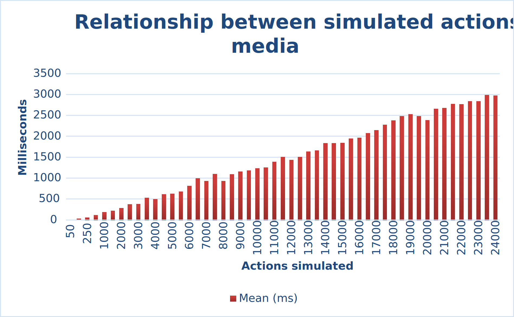
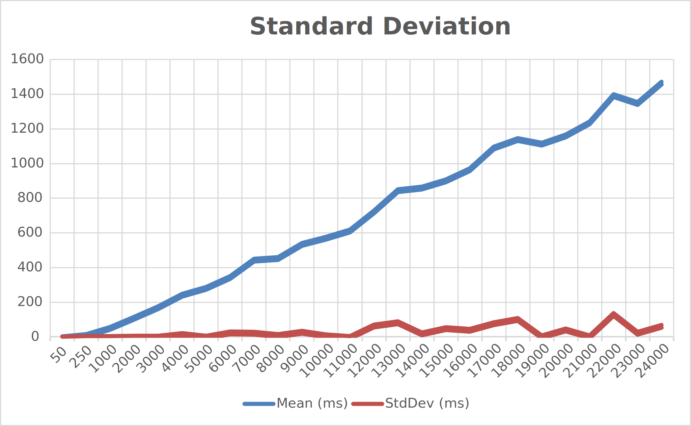

# Simulator Automatic Warehouse

[](https://codecov.io/gh/AndreVale69/simulator-automatic-warehouse)

🚧 _Codecov and tests work in progress..._ 🚧

This README is **out of date**. I'm developing a `1.0.0` version on [andre-branch](https://github.com/AndreVale69/simulator-automatic-warehouse/tree/andre-branch). 
The project is almost finished, and I'm studying how to make it available online using `pip`.
So the following `README` refers to my bachelor's thesis (see [v0.0.1 pre-release](https://github.com/AndreVale69/simulator-automatic-warehouse/releases/tag/v0.0.1-bachelors-degree-thesis)).

This repository was created for a thesis project for the University of Verona (Università di Verona).

The project is a simulator of an automatic warehouse. The inspiration came from the [Vertimag][1] of 
[Ferretto Group][2], an Italian company based in Vicenza. 
So the logic of the warehouse digitalized is the same of the real Vertimag.

As a case study, the Vertimag present in the [ICE Laboratory][3] was chosen.
The warehouse you'll find is made for education/research purposes, so it's different from a classic Vertimag 
that you can find in the industries (see the differences in these photos: [ICELab Vertimag][4] and [Industries Vertimag][1]). 
However, this does not mean that the project is not valid!
In fact, the project is used as a base by the researchers at the ICELab to make another simulator using different 
technologies.

The repository contains a `src` directory where you can find: the **simulator** and the **webpage**.

The simulator is mainly made using [SimPy v4.0.2][5] and simulates 4 actions (you can implement more if you need to). 
The webpage is made using [Dash v2.15.0][6] (with the support of [Dash Bootstrap Components v1.5.0][7]) and 
[Plotly v5.17.0][8] to allow the end-user, in this case the thesis advisor, 
to interact with the simulator in a user-friendly way.

------------------------------------------------------------------------------------------------------------------------

## How to Install and Run the Project

You can choose to run the project in one of two ways: using [Python v3.12.2][9] or using [Docker][10] 
and [Docker compose][13].

### Python

Install the requirements using [pip][11]:

```bash
pip install -r requirements.txt
```

#### Simulator

To run only the simulator without the webpage, go to the project directory simulator-automatic-warehouse 
and set the environment variable for the configuration. 
Each simulation uses a yaml file to set up the automatic warehouse 
(a full explanation of the config file can be found in 
[configuration/sample_config.yaml](configuration/sample_config.yaml):

```bash
export WAREHOUSE_CONFIGURATION_FILE_PATH=configuration/univr/ICE_lab.yaml
python3.12 run_simulator.py
```

Or one line:

```bash
WAREHOUSE_CONFIGURATION_FILE_PATH=configuration/univr/ICE_lab.yaml python3.12 run_simulator.py
```

The loaded configuration represents the Vertimag in ICELab. 
You can create another configuration following the json schema 
([resources/configuration/json_schema.json](resources/configuration/json_schema.json)).

Finally, it's possible to manage the console log using the environment variables:
 - `NO_CONSOLE_LOG`: If set, console logs are not displayed.
 - `DEBUG_LOG`: if set, debug logging will be printed to the console.
 - `FILENAME_DEBUG_LOG`: if set, save the debug log to file (e.g. `log`).

#### Website

To run the website, in addition to the environment variables specified in the [Simulator](#simulator) section,
you need to specify:
 - `HOST`: Host IP used to serve the application.
 - `PORT`: Port used to serve the application.
 - (optional) `PROXY`: If this application will be served to a different URL via a proxy configured outside of Python, 
                     you can list it here as a string of the form `{input}::{output}`, for example: 
                     `http://0.0.0.0:8050::https://my.domain.com` 
                     so that the startup message will display an accurate URL.

For example, in localhost:

```bash
export WAREHOUSE_CONFIGURATION_FILE_PATH=configuration/univr/ICE_lab.yaml
export HOST=127.0.0.1
export PORT=8050
python3.12 run_webpage.py
```

**Note**: 
the username and password to access at the page can be found in the [`index.py`](tmp/web_app/index.py) file 
after the `app` variable declaration. 
The default, the values are:

```python
USER_PWD = {
    "admin": "admin"
}
```

But you can specify other users (see the complete documentation: [Dash Authentication][12]).

### Docker

Everything is easier with Docker. Go to the [docker](docker) folder and use docker compose to build:

```bash
cd docker && docker compose up
```

If you want to change or add some environment variables, edit [docker-compose.yaml](docker/docker-compose.yaml).

------------------------------------------------------------------------------------------------------------------------

## Benchmarks

Here are some benchmarks run with a private Python library and the following computer specifications:
 - Intel i7-8750H 
 - SDRAM DDR4-2666 16GB
 - MZ-76Q2T0 860 QVO SSD 2TB 2.5"
 - SSD NVMe M.2 128 GB
 - NVIDIA GeForce GTX 1050

| Actions   | Time to process | Real-time simulation |
|-----------|-----------------|----------------------|
| 10'000    | 1 second        | 1d. 2h. 48m.         |
| 63'000    | 7.5 seconds     | 1 week               |
| 267'900   | 25 seconds      | 1 month              |
| 3'250'120 | 9 minutes       | 1 year               |





[1]: https://www.ferrettogroup.com/index.cfm/en/solutions/vertical-storage-system/vertical-lift-module-vertimag/
[2]: https://www.ferrettogroup.com/index.cfm/en/
[3]: https://www.icelab.di.univr.it/
[4]: https://icewebsitestorage.blob.core.windows.net/icewebsitemediablob/gallery/IMG_0855.JPG
[5]: https://simpy.readthedocs.io/en/4.0.2/
[6]: https://dash.plotly.com/
[7]: https://dash-bootstrap-components.opensource.faculty.ai/
[8]: https://plotly.com/python/
[9]: https://www.get-python.org/downloads/release/python-3122/
[10]: https://docs.docker.com/engine/
[11]: https://pip.pypa.io/en/stable/getting-started/
[12]: https://dash.plotly.com/authentication
[13]: https://docs.docker.com/compose/