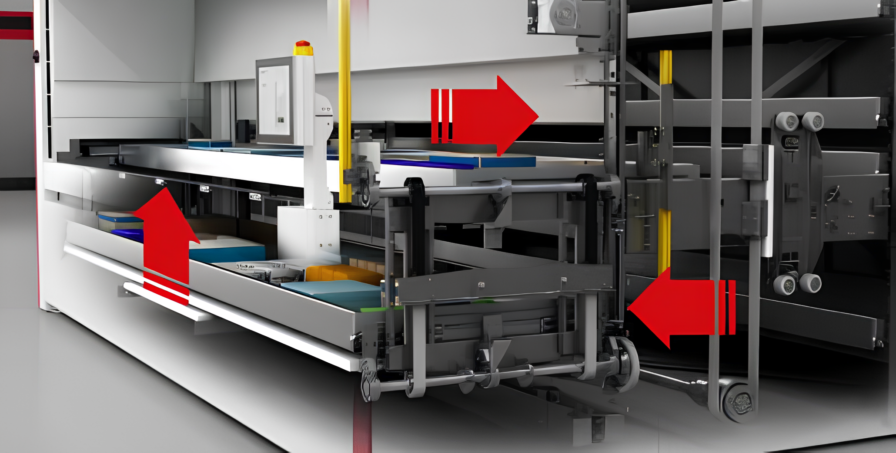

.. _carousel:

========
Carousel
========

The Carousel is a complex system in the Simulator Automatic Warehouse. 
In the library it refers to three main parts: the buffer, the bay and the "hole".

- The **Bay** is the tray that is exposed to the outside and where an operator can place/pick materials.

- The **Hole** is the space above the *Bay*.

- The **Buffer** is the tray under the *Bay*. It is called "*buffer*" because it can store a tray that 
  can be shown immediately when the tray on the bay goes into the warehouse.

.. figure:: ../../../../_static/carousel/carousel.jpeg
   :scale: 10 %
   :align: center
   :alt: carousel

   Division of the carousel.
   
An important thing to understand is how the movement of the carousel is modelled.
The following figure, taken from the Ferretto website, 
may explain the movement of the tray on the bay and the tray on the buffer.

   How the carousel works.

There are two possible situations:

1. **Send a tray to a column**:
   
   - An operator clicks on the warehouse display and gives the command to send the tray to the bay inside the warehouse. 
     The automatic warehouse then picks up the tray in the bay and moves it towards the centre;
   
   - At the same time, if the warehouse finds a tray in the buffer zone, it asynchronously sends the tray from the buffer to the bay.

2. **Calling a tray in the bay**:

   - An operator clicks on the warehouse display and gives the command to call a tray into the bay;
   
   - Now there are two possibilities:
     
     - The bay is empty and consequently the buffer is empty. The destination of the tray is in the bay.
     
     - The bay is occupied. The destination of the tray is in the buffer.

In the Carousel class you will find some useful methods to check the status. For example, if the slot is full, or if the buffer is full, etc.
