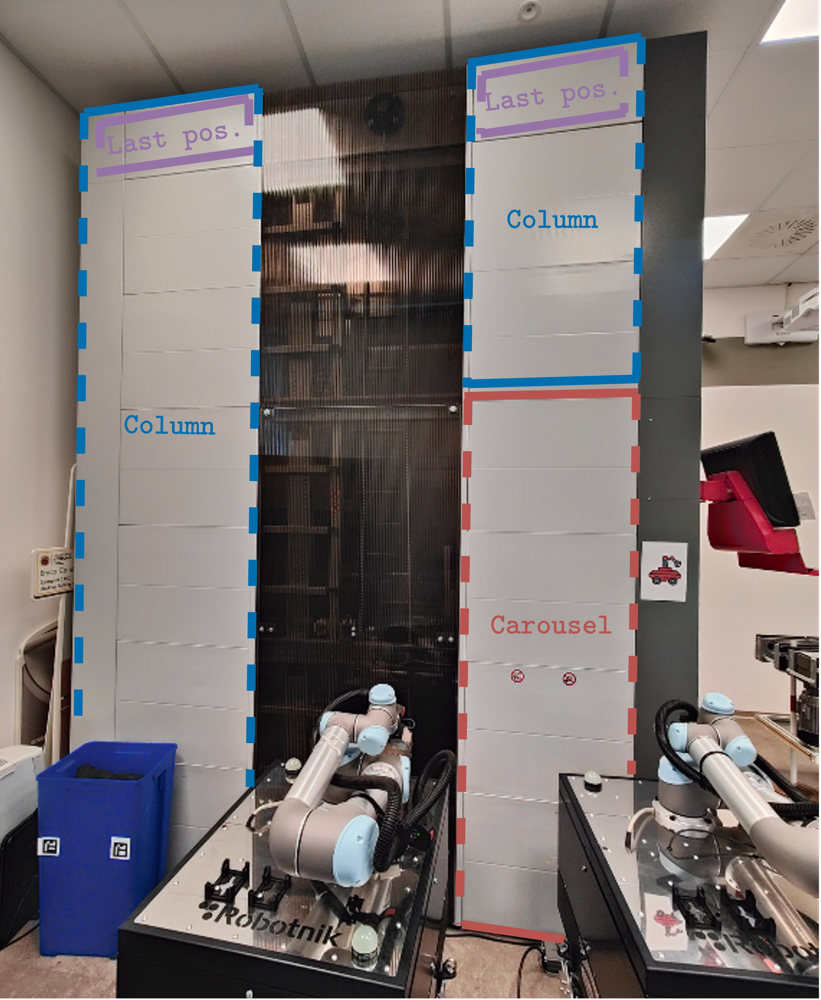
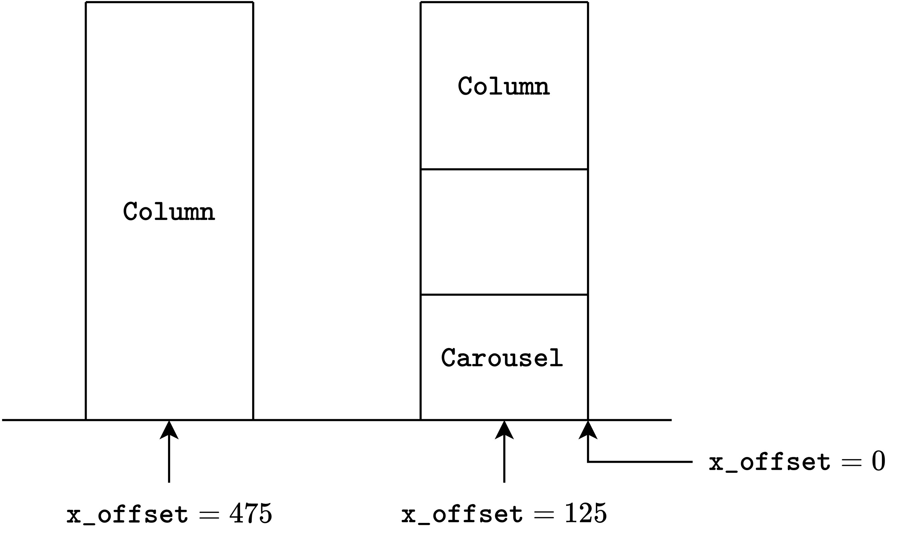

======
Column
======

In the Simulator Automatic Warehouse, a column is a tray container that can hold the trays.

There is a big difference to the carousel.
The column can only hold trays (possibly with materials) and there is no picking zone.
An operator cannot place or remove material from the bay because a column is an elementary unit that can only hold the trays.

The figure below shows a Ferretto Vertimag photographed from the side.

   Terminology: what is a *Column* for the Simulator Automatic Warehouse library?

Note that each column has an interesting feature: the last position is fixed and its height cannot be changed.
This is a peculiarity of these industrial machines.

Perhaps you have an interesting question about *how the library can understand where the column is?*

For example, see the figure; how can you create your digital twin and say to the library, "*put the column in this position*"?
The answer is to use the **x offset**.
The Simulator Automatic Warehouse identifies each column by its x offset.
From the carousel, the x offset should be 125, and this value increases as you move away from the carousel.

The value is 125 because it takes the centre of the column (and not the right side, which is 0).

   Explanation of x-offset.
