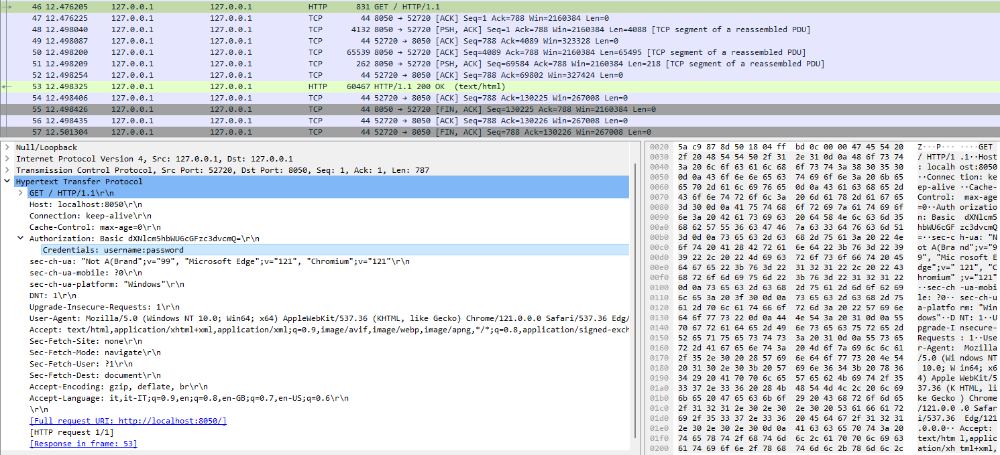

# Security Weaknesses

This folder contains some known security vulnerabilities.

------------------------------------------------------------------------------------------------------------------------

## Authentication

### HTTP

To access the site, there is 
[basic HTTP authentication](https://developer.mozilla.org/en-US/docs/Web/HTTP/Authentication).
This authentication is implemented in code using the [Dash-Auth library](https://github.com/plotly/dash-auth).

A known vulnerability is the HTTP protocol, so this method is subject to a man-in-the-middle attack.

